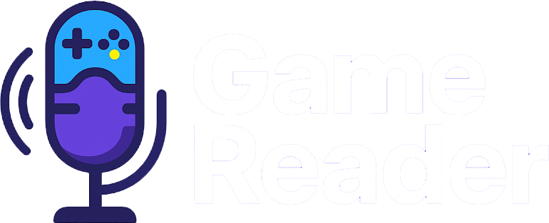

<div align="center">



# GameReader

**v0.9.5 beta**

[](https://www.python.org/)
[](https://doc.qt.io/qtforpython/)
[](https://github.com/JaidedAI/EasyOCR)
[](LICENSE)
[](https://www.microsoft.com/windows)
[](https://www.gamereader.pl)

<br/>

<a href="#polski"></a>
&nbsp;&nbsp;
<a href="#english"></a>

</div>


---

<a id="polski"></a>

# 🇵🇱 POLSKI

<details open>
<summary><b>Rozwiń / Zwiń sekcję polską</b></summary>

## Opis projektu

**GameReader** to aplikacja desktopowa dla systemu Windows, która w czasie rzeczywistym **odczytuje tekst dialogowy z ekranu gry** przy użyciu OCR (EasyOCR), a następnie **automatycznie odtwarza odpowiedni plik audio (dubbing/lektor)**, synchronizując go z aktualnie wyświetlaną linią dialogową.

Program uruchamia się w zasobniku systemowym i działa w tle — nie ingeruje w działanie gry, nie wymaga modów, działa z każdą grą wyświetlającą tekst dialogowy na ekranie.

Projekt powstał z pasji do gier i doświadczeń audiowizualnych, lecz szybko okazał się mieć ogromne znaczenie społeczne — stając się realnym wsparciem dla **osób z niepełnosprawnościami oraz seniorów**, dla których śledzenie napisów dialogowych stanowi poważne utrudnienie.

> _"Najbardziej wzruszającym aspektem projektu jest reakcja użytkowników. GameReader okazał się mieć ogromne znaczenie społeczne, ułatwiając dostępność gier osobom z trudnościami w czytaniu lub śledzeniu napisów."_

---

## Jak to działa — szczegółowo

### 1. Przechwytywanie ekranu

`mss` co `CAPTURE_INTERVAL` sekund (domyślnie `0.5s`, zakres `0.1–5.0s`) przechwytuje zdefiniowany prostokąt ekranu. Przed podaniem do OCR obraz jest skalowany (`RESOLUTION_DOWNSCALE`, domyślnie `0.45`) i wstępnie przetwarzany:

- **Przy scale ≥ 0.7** — ekstrakcja kanału max z RGB (jasny tekst na ciemnym tle), erozja jądrem eliptycznym 3×3 (usuwa glow/bloom wokół liter), CLAHE, wyostrzanie
- **Przy scale < 0.7** — standardowy szary obraz (EasyOCR radzi sobie sam)
- **Frame diffing** — jeśli różnica między klatką bieżącą a poprzednią jest < `FRAME_DIFFERENCE_THRESHOLD`, klatka jest pominięta (bez OCR)

### 2. OCR (EasyOCR)

- Silnik: EasyOCR, język `pl`, GPU=False, `quantize=True`
- Wyniki sortowane wg pozycji Y → X (kolejność czytania od góry-lewej)
- Filtr wysokości: elementy OCR spoza zakresu `MIN_HEIGHT`–`MAX_HEIGHT` (w px oryginału) są odrzucane
- W trybie typewriter: elementy z pewnością < `OCR_MIN_CONFIDENCE` (domyślnie `0.4`) są odrzucane
- Elementy grupowane w linie wg odległości Y (próg `LINE_THRESHOLD`)

### 3. Filtrowanie imion postaci

Gdy włączone (`ENABLE_REMOVE_CHARACTER_NAME`), przed dopasowaniem:
- **Format `Imię:`** — jeśli tekst zaczyna się od `Imię:` lub `Imię;` z pliku imion → usuwa prefiks
- **Format wieloliniowy** — jeśli pierwsza linia jest krótka (≤ 4 słowa, ≤ 40 znaków) i pasuje do pliku imion (`fuzz.ratio ≥ 90%`) → usuwa pierwszą linię
- Filtr śmieciowy OCR: tekst < 3 znaków lub z > 30% znaków niebędących literami/spacją jest odrzucany

### 4. Filtr linii centralnych

Opcjonalne 3 pionowe pasy na ekranie — OCR zatrzymuje tylko elementy przecinające wybrany pas:
- **Linia 1** — środek ekranu ± `CENTER_LINE_MARGIN / 2`
- **Linia 2** — od stałego X (`CENTER_LINE_2_START`) przez szerokość marginesu
- **Linia 3** — od `CENTER_LINE_3_START_RATIO × szerokość_ekranu` przez szerokość marginesu

Zrzuty ekranu zapisują się z niebieską nakładką pokazującą aktywne pasy (80% przezroczystości).

### 5. Dopasowanie rozmyte

```
fuzz.ratio(ocr_text.lower(), dialog_line.lower())
```

Algorytm okienkowy, kierunkowy:

| Parametr | Wartość domyślna | Opis |
|---|---|---|
| `SIMILARITY_THRESHOLD` | `60` | Minimalny score dla linii ≥ 8 znaków |
| `SIMILARITY_THRESHOLD2` | `80` | Minimalny score dla linii < 8 znaków |
| `_FORWARD_WINDOW` | `400` | Ile linii do przodu od ostatniego trafienia |
| `_BACK_WINDOW` | `30` | Ile linii wstecz dopuszczamy |
| `_GLOBAL_OVERRIDE_MARGIN` | `12` | O ile pkt globalny musi bić okienkowy by przejąć |
| `_SCORE_MARGIN` | `5` | Margines kandydatów od najlepszego score |

Dodatkowe zabezpieczenia:
- Tekst OCR 2× dłuższy niż kandydująca linia i score < 90 → odrzucony (fałszywy fragment)
- Dedup: jeśli dopasowana linia jest ≥ 92% podobna do ostatnio odtwarzanej → pomijana
- Dedup indeksowy: ten sam numer linii nie może pojawić się dwa razy z rzędu

### 6. Tryb typewriter (animowane napisy)

Gdy tekst pojawia się literka po literce:
- Porównuje OCR do **prefiksu** linii dialogowej (`line[:len(ocr_text)]`), nie do całości
- Odrzuca fragment jeśli pokrywa < `TYPEWRITER_MIN_COVERAGE` (65%) długości linii docelowej
- Sprawdza pierwsze 4 znaki OCR vs linii — muszą pasować w ≥ 60%
- Jeśli rywal ma score w marginesie `_TYPEWRITER_DISAMBIG_MARGIN` (20 pkt) → czeka na więcej tekstu
- Po `TYPEWRITER_STABLE_READS` (2) identycznych klatkach uznaje tekst za kompletny i odpala

### 7. Tryb wielu dialogów (Paragraph OCR)

Zamiast łączenia wszystkich elementów w jeden string, OCR grupuje je w **klastry pionowe** (duże przerwy Y → nowy paragraf). Każdy paragraf przetwarzany jest osobno — pozwala to wykrywać kilka jednoczesnych dialogów.

### 8. Audio

- Nazwy plików: `output1 (N).ext` gdzie N = numer linii (1-based), np. `output1 (42).ogg`
- pygame mixer: `44100 Hz`, `16-bit`, `2 kanały`, `buffer=512`
- Kolejka audio: rozmiar `1–3` (konfigurowalne)
- Prędkość **bazowa** (`BASE_PLAYBACK_SPEED`): `0.8–1.2×`, krok `0.01`, domyślnie `1.0×`
- Prędkość **overlap** (`OVERLAP_PLAYBACK_SPEED`): `1.0–3.0×`, domyślnie `1.2×` — używana gdy kolejka/odtwarzanie zajęte
- Algorytm zmiany prędkości: pydub (jeśli dostępny) lub własny OLA (Overlap-Add)
- LRU cache `(ścieżka, prędkość)`: max 15 wpisów (unika ponownego przetwarzania)

### 9. Wyciszanie gry (Audio Ducking)

Gdy lektor zaczyna mówić, GameReader **płynnie wycisza wszystkie inne aplikacje Windows** (przez pycaw / ISimpleAudioVolume):
- Poziom redukcji: `VOLUME_REDUCTION_LEVEL` (domyślnie `20%`)
- Czas fade: `VOLUME_FADE_DURATION` (domyślnie `0.2s`)
- Po zakończeniu odtwarzania głośność innych aplikacji wraca automatycznie

### 10. Skalowanie rozdzielczości

Gdy gracz zmienia rozdzielczość gry, GameReader **automatycznie przelicza** obszary przechwytywania:
- Wyznacza rdzeń 16:9 z rozdzielczości źródłowej i docelowej
- Skaluje proporcjonalnie: `top`, `left`, `width`, `height`, `RESOLUTION_DOWNSCALE`, `MIN_HEIGHT`, `MAX_HEIGHT`
- Obsługuje tryby: ultrawide (21:9), 4:3, 16:10 — offset dla niestandardowych proporcji
- Można zablokować przeliczanie przełącznikiem „Zablokuj przeliczanie"

---

## Wymagania systemowe

| | Minimum | Zalecane |
|---|---|---|
| **System** | Windows 10 (64-bit) | Windows 11 (64-bit) |
| **CPU** | 4 rdzenie | 6 rdzeni+ |
| **RAM** | 4 GB | 8 GB+ |
| **GPU** | — | opcjonalne (EasyOCR działa na CPU) |
| **Python** | 3.10+ | 3.11+ |

---

## Instalacja

```bash
# 1. Sklonuj repozytorium
git clone https://github.com/gamereader/gamereader.git
cd gamereader

# 2. Utwórz środowisko wirtualne
python -m venv venv
venv\Scripts\activate

# 3. Zainstaluj zależności
pip install -r requirements.txt

# 4. Uruchom aplikację
python main.py
```

---

## Pierwsze uruchomienie

1. **Uruchom GameReader** — pojawi się w zasobniku systemowym
2. **Zakładka „Pliki"** — wskaż:
   - 📂 Folder z plikami audio — pliki muszą mieć nazwy `output1 (1).ogg`, `output1 (2).ogg`, ...
   - 📄 Plik tekstowy z dialogami — **jedna linia = jeden dialog**, numer linii = numer pliku audio
   - 📄 *(opcjonalnie)* Plik z imionami postaci — do odfiltrowania prefixów (jedno imię per linia)
   - 📂 *(opcjonalnie)* Folder do zapisu zrzutów ekranu
3. **Zakładka „Szybki start"** — wybierz rozdzielczość gry (obszary zostaną automatycznie przeliczone)
4. **Zakładka „Obszar ekranu"** — ustaw prostokąt przechwytywania nad paskiem dialogowym
5. **Zapisz preset** — konfiguracja zapiszę się jako plik JSON
6. **Naciśnij `Home`** — lektor startuje

> Gra powinna być uruchomiona w **trybie okienkowym** lub **borderless** — nie w pełnym ekranie.

---

## Skróty klawiszowe

| Akcja | Skrót domyślny |
|---|---|
| ▶️ Włącz / Wyłącz lektora | `Home` |
| 🔊 Głośność lektora +5% | `Page Up` |
| 🔉 Głośność lektora -5% | `Page Down` |
| ⏹️ Przerwij audio (następny z kolejki) | `Delete` |
| 🖥️ Przełącz obszar 1 / obszar 2 | `Alt + 1` |
| 📐 Przełącz widoczność obszarów | `Alt + 2` |
| 🔧 Otwórz okno ustawień | `Alt + \`` |
| 🐛 Konsola debug (overlay) | `Alt + D` |
| 🎵 Test dźwięku | `Insert` |
| ⏩ Prędkość bazowa +0.01× | `Shift + Z` |
| ⏪ Prędkość bazowa -0.01× | `Shift + X` |
| ⏩ Prędkość overlap +0.01× | `Shift + C` |
| ⏪ Prędkość overlap -0.01× | `Shift + V` |

> Wszystkie skróty są w pełni konfigurowalne w zakładce **Skróty klawiszowe**. Debounce: 250ms.

---

## Obsługiwane formaty audio

| Format | Uwagi |
|---|---|
| `.ogg` | Zalecany — najlepsza wydajność z pygame |
| `.mp3` | Pełne wsparcie |
| `.m4a` | Wymaga ffmpeg |
| `.aac` | Wymaga ffmpeg |
| `.flac` | Pełne wsparcie |
| `.mp4` | Ścieżka audio z kontenera MP4 |

---

## Obsługiwane rozdzielczości

`1280×720` · `1280×800` · `1366×768` · `1600×900` · `1920×1080` · `1920×1200` · `2560×1080` · `2560×1440` · `3440×1440` · `3840×2160` · `4096×2160` · `5120×2160`

---

## Tryb równoległy OCR (CLI)

```bash
# Przetwarzanie wsadowe — 4 procesy, 3 wątki każdy
python main.py --ocr-parallel "C:\klatka1.png,C:\klatka2.png,C:\klatka3.png"
```

Każdy proces roboczy uruchamia własną instancję EasyOCR. Jeśli dostępny jest `threadpoolctl`, wątki BLAS/OpenMP/PyTorch są ograniczane per-proces. Przydatne do wyekstrahowania tekstu z dużych zbiorów klatek wideo (np. MP4 → ramki → OCR → pliki dialogów).

---

## Zakładki aplikacji

| Zakładka | Zawartość |
|---|---|
| **Szybki start** | Wybór rozdzielczości, auto-skalowanie obszarów, ostatnie presety |
| **Pliki** | Ścieżki do audio, dialogów, imion postaci, zrzutów; toggle usuwania imion |
| **Obszar ekranu** | Definiowanie 2 prostokątów przechwytywania (top/left/width/height), selektor ekranu |
| **Zaawansowane** | OCR quality (downscale), interwał, min/max wysokość, linie centralne, prędkości, ducking, kolejka |
| **Skróty klawiszowe** | Rekonfiguracja wszystkich 13 akcji |
| **O programie** | Wersja, opis, linki, team |

---

## Struktura projektu

```
gamereader/
├── main.py                   # Entry point, single-instance lock, QApplication
├── core/
│   ├── app.py                # Główna pętla OCR→match→play, _find_best_match()
│   ├── constants.py          # Wszystkie wartości domyślne i zakresy
│   ├── state.py              # Globalny stan runtime (monitor, audio, OCR)
│   ├── debug.py              # Thread-safe logger z deque (max 1000 wpisów)
│   ├── paths.py              # Ścieżki (assets, EasyOCR model, ffmpeg, sounds)
│   ├── resolution_scaling.py # Przeliczanie obszarów między rozdzielczościami
│   └── validation.py         # Walidacja STRICT/SOFT przed startem lektora
├── ocr/
│   ├── capture.py            # mss capture, preprocessing, EasyOCR, frame diff
│   ├── filters.py            # Filtr imion postaci, filtr linii centralnych
│   └── parallel.py           # multiprocessing.Pool + per-process EasyOCR init
├── audio/
│   ├── player.py             # Kolejka audio, wątek odtwarzania, LRU speed cache
│   ├── speed.py              # OLA stretch, pydub speedup, ffmpeg bridge
│   └── volume.py             # pycaw ducking, fade in/out, kroki głośności 0–100%
├── input/
│   └── hotkeys.py            # ctypes keyboard polling, debounce, pending actions
├── presets/
│   ├── manager.py            # JSON save/load, legacy migration (< 0.9.3)
│   └── schema.py             # Schemat presetu, PresetValidationError
├── ui/
│   ├── main_window.py        # Sidebar + AnimatedStackedWidget, tray icon
│   ├── widgets.py            # ToggleSwitch, IconComboBox, LoadingOverlay, ...
│   ├── tooltips.py           # Słownik podpowiedzi dla pól UI
│   ├── keymap.py             # Normalizacja sekwencji klawiszy Qt ↔ wewnętrzny format
│   ├── debug_window.py       # Pływające okno logów debug
│   ├── tab/
│   │   ├── start_tab.py      # Rozdzielczość, lock_scaling, ostatnie presety
│   │   ├── files_tab.py      # Ścieżki, toggle ENABLE_REMOVE_CHARACTER_NAME
│   │   ├── screen_tab.py     # Monitor 1/2 (top/left/width/height), selektor ekranu
│   │   ├── advanced_tab.py   # OCR params, linie centralne, audio system toggle
│   │   ├── shortcuts_tab.py  # Rebind 13 akcji
│   │   └── about_tab.py      # Logo, wersja, team, linki
│   ├── overlay/
│   │   ├── debug_overlay.py  # Semi-transparent overlay z logami (Alt+D)
│   │   ├── hotkeys_overlay.py # Krótki overlay po akcji hotkeyem
│   │   └── screen_area_selector.py # Drag & drop obszaru na ekranie
│   └── theme/
│       ├── theme.py          # Stałe kolorów, rozmiarów, marginesów
│       └── global_qss.py     # Buduje arkusz QSS z palety
├── utils/
│   └── system.py             # Lock plik PID w tempdir, set_low_priority, merge_key_bindings
├── assets/
│   ├── fonts/                # Nunito-Regular.ttf
│   └── images/               # logo.png, ikony UI
└── resources/
    ├── bin/                  # ffmpeg.exe, ffprobe.exe, frozen_east_text_detection.pb
    └── sounds/               # test.ogg i inne dźwięki systemowe
```

---

## Stack technologiczny

| Warstwa | Technologia | Zastosowanie |
|---|---|---|
| GUI | PySide6 (Qt 6) + qtawesome | Okno, zakładki, animacje, tray |
| OCR | EasyOCR + PyTorch | Rozpoznawanie tekstu z klatki |
| Screen capture | mss | Szybkie przechwytywanie obszaru ekranu |
| Image processing | OpenCV, NumPy, Pillow | Preprocessing, frame diff, zrzuty |
| Audio | pygame (mixer) | Odtwarzanie, kolejka, fade |
| Audio speed | pydub + ffmpeg / OLA | Zmiana tempa bez zmiany tonu |
| Audio ducking | pycaw (Windows Audio) | Wyciszanie innych aplikacji |
| Fuzzy matching | rapidfuzz | Dopasowanie OCR → linia dialogu |
| Font | Nunito (Google Fonts) | Czcionka UI |

---

## Wkład w projekt

Projekt jest **open source** — wkład jest mile widziany!

1. Fork repozytorium
2. Utwórz gałąź: `git checkout -b feature/twoja-funkcja`
3. Zatwierdź: `git commit -m "feat: opis zmian"`
4. Wypchnij: `git push origin feature/twoja-funkcja`
5. Otwórz Pull Request

---

## Licencja

Copyright © 2026 GameReader. Projekt open source — szczegóły w pliku [LICENSE](LICENSE).

</details>

---
---

<a id="english"></a>

# 🇬🇧 ENGLISH

<details open>
<summary><b>Expand / Collapse English section</b></summary>

## About the Project

**GameReader** is a Windows desktop application that **reads game dialogue text in real-time** using OCR (EasyOCR), then **automatically plays the matching audio file (dubbing/narrator)**, keeping it in sync with the on-screen dialogue.

It runs in the system tray in the background — no mods required, no game files touched. Works with any game that renders dialogue text on screen.

The project was born from a passion for games and audiovisual experiences, but quickly grew into something much more meaningful — becoming a real accessibility tool for **people with disabilities and the elderly** who struggle to follow in-game text subtitles.

> _"The most touching aspect of the project is the response from users. GameReader has proven to have enormous social significance, making games accessible to people with reading difficulties or those unable to follow subtitles."_

---

## How it works — in detail

### 1. Screen capture

`mss` grabs the configured rectangle every `CAPTURE_INTERVAL` seconds (default `0.5s`, range `0.1–5.0s`). Before OCR, the frame is scaled (`RESOLUTION_DOWNSCALE`, default `0.45`) and preprocessed:

- **At scale ≥ 0.7** — per-channel max extraction (brightens cyan/white/yellow text on dark background), 3×3 elliptical erosion (removes glow/bloom around letters), CLAHE, sharpening
- **At scale < 0.7** — standard grayscale (EasyOCR handles it natively)
- **Frame diffing** — if `np.absdiff` between current and previous frame / frame size is below `FRAME_DIFFERENCE_THRESHOLD`, the frame is skipped (no OCR call)

### 2. OCR (EasyOCR)

- Engine: EasyOCR, language `pl`, GPU=False, `quantize=True`
- Results sorted by Y → X (top-left reading order)
- Height filter: OCR elements outside `MIN_HEIGHT`–`MAX_HEIGHT` (in original pixels) are discarded
- In typewriter mode: elements below `OCR_MIN_CONFIDENCE` (default `0.4`) are discarded
- Elements grouped into lines by Y proximity (threshold `LINE_THRESHOLD`)

### 3. Character name filter

When enabled (`ENABLE_REMOVE_CHARACTER_NAME`), before matching:
- **`Name:` format** — if text starts with `Name:` or `Name;` from the names file → strips prefix
- **Multi-line format** — if the first line is short (≤ 4 words, ≤ 40 chars) and fuzzy-matches a name (`fuzz.ratio ≥ 90%`) → removes first line
- OCR garbage filter: text < 3 chars or with > 30% non-letter/non-space characters is discarded

### 4. Center line filter

3 optional vertical bands on screen — OCR keeps only elements intersecting the active band:
- **Line 1** — screen center ± `CENTER_LINE_MARGIN / 2`
- **Line 2** — from fixed X (`CENTER_LINE_2_START`) by margin width
- **Line 3** — from `CENTER_LINE_3_START_RATIO × screen_width` by margin width

Screenshots are saved with a blue overlay (80% opacity) showing active bands.

### 5. Fuzzy matching

```
fuzz.ratio(ocr_text.lower(), dialog_line.lower())
```

Directional windowed algorithm:

| Parameter | Default | Description |
|---|---|---|
| `SIMILARITY_THRESHOLD` | `60` | Minimum score for lines ≥ 8 chars |
| `SIMILARITY_THRESHOLD2` | `80` | Minimum score for lines < 8 chars |
| `_FORWARD_WINDOW` | `400` | Lines ahead to search from last match |
| `_BACK_WINDOW` | `30` | Lines back allowed |
| `_GLOBAL_OVERRIDE_MARGIN` | `12` | Global winner must beat window winner by this to override |
| `_SCORE_MARGIN` | `5` | Candidate margin from best score |

Additional safeguards:
- OCR text 2× longer than candidate and score < 90 → rejected (false fragment match)
- Dedup: if matched line is ≥ 92% similar to last played line → skipped
- Index dedup: same line number cannot appear twice in a row

### 6. Typewriter mode (animated subtitles)

When text appears letter by letter:
- Compares OCR to the **prefix** of the dialogue line (`line[:len(ocr_text)]`), not the full line
- Rejects fragment if it covers < `TYPEWRITER_MIN_COVERAGE` (65%) of target line length
- Checks first 4 chars of OCR vs line — must match ≥ 60%
- If a rival line is within `_TYPEWRITER_DISAMBIG_MARGIN` (20 pts) → waits for more text
- After `TYPEWRITER_STABLE_READS` (2) identical frames, considers text complete and fires

### 7. Paragraph OCR mode (multiple simultaneous dialogues)

Instead of merging all OCR elements into one string, this mode groups them into **vertical clusters** (large Y gaps = new paragraph). Each paragraph is matched and played separately — detects multiple simultaneous dialogue boxes.

### 8. Audio

- File naming: `output1 (N).ext` where N = 1-based line number, e.g. `output1 (42).ogg`
- pygame mixer: `44100 Hz`, `16-bit`, `2 channels`, `buffer=512`
- Audio queue size: `1–3` (configurable)
- **Base speed** (`BASE_PLAYBACK_SPEED`): `0.8–1.2×`, step `0.01`, default `1.0×`
- **Overlap speed** (`OVERLAP_PLAYBACK_SPEED`): `1.0–3.0×`, default `1.2×` — used when queue or playback is busy
- Speed algorithm: pydub (if available) or custom OLA (Overlap-Add)
- LRU cache `(filepath, speed)`: max 15 entries (avoids re-processing the same file+speed)

### 9. Audio ducking

When the narrator speaks, GameReader **smoothly lowers all other Windows app volumes** (via pycaw / ISimpleAudioVolume):
- Reduction level: `VOLUME_REDUCTION_LEVEL` (default `20%`)
- Fade duration: `VOLUME_FADE_DURATION` (default `0.2s`)
- After playback ends, other apps' volumes are restored automatically

### 10. Resolution scaling

When the player changes game resolution, GameReader **automatically recalculates** capture areas:
- Extracts the 16:9 core from both source and target resolution (handles ultrawide, 4:3, 16:10 with offset)
- Scales proportionally: `top`, `left`, `width`, `height`, `RESOLUTION_DOWNSCALE`, `MIN_HEIGHT`, `MAX_HEIGHT`
- Can be locked with the "Lock scaling" toggle

---

## System Requirements

| | Minimum | Recommended |
|---|---|---|
| **OS** | Windows 10 (64-bit) | Windows 11 (64-bit) |
| **CPU** | 4-core | 6-core+ |
| **RAM** | 4 GB | 8 GB+ |
| **GPU** | — | optional (EasyOCR runs on CPU) |
| **Python** | 3.10+ | 3.11+ |

---

## Installation

```bash
# 1. Clone the repository
git clone https://github.com/gamereader/gamereader.git
cd gamereader

# 2. Create a virtual environment
python -m venv venv
venv\Scripts\activate

# 3. Install dependencies
pip install -r requirements.txt

# 4. Run the application
python main.py
```

---

## First Launch

1. **Launch GameReader** — it appears in the system tray
2. **"Files" tab** — set:
   - 📂 Audio folder — files must be named `output1 (1).ogg`, `output1 (2).ogg`, ...
   - 📄 Dialogue text file — **one line = one dialogue**, line number = audio file number
   - 📄 *(optional)* Character names file — filters name prefixes (one name per line)
   - 📂 *(optional)* Screenshot output folder
3. **"Quick Start" tab** — select game resolution (capture areas auto-rescale)
4. **"Screen Area" tab** — set the capture rectangle over the dialogue bar
5. **Save preset** — configuration saved as a JSON file
6. **Press `Home`** — reader starts

> The game should run in **windowed** or **borderless windowed** mode — not fullscreen exclusive.

---

## Keyboard Shortcuts

| Action | Default Shortcut |
|---|---|
| ▶️ Toggle reader on/off | `Home` |
| 🔊 Narrator volume +5% | `Page Up` |
| 🔉 Narrator volume -5% | `Page Down` |
| ⏹️ Interrupt audio (skip to next in queue) | `Delete` |
| 🖥️ Switch area 1 / area 2 | `Alt + 1` |
| 📐 Toggle area visibility | `Alt + 2` |
| 🔧 Open settings window | `Alt + \`` |
| 🐛 Debug console overlay | `Alt + D` |
| 🎵 Test sound | `Insert` |
| ⏩ Base speed +0.01× | `Shift + Z` |
| ⏪ Base speed -0.01× | `Shift + X` |
| ⏩ Overlap speed +0.01× | `Shift + C` |
| ⏪ Overlap speed -0.01× | `Shift + V` |

> All shortcuts are fully configurable in the **Keyboard Shortcuts** tab. Debounce: 250ms.

---

## Supported Audio Formats

| Format | Notes |
|---|---|
| `.ogg` | Recommended — best performance with pygame |
| `.mp3` | Full support |
| `.m4a` | Requires ffmpeg |
| `.aac` | Requires ffmpeg |
| `.flac` | Full support |
| `.mp4` | Audio track from MP4 container |

---

## Supported Resolutions

`1280×720` · `1280×800` · `1366×768` · `1600×900` · `1920×1080` · `1920×1200` · `2560×1080` · `2560×1440` · `3440×1440` · `3840×2160` · `4096×2160` · `5120×2160`

---

## Parallel OCR Mode (CLI)

```bash
# Batch processing — 4 processes, 3 threads each
python main.py --ocr-parallel "C:\frame1.png,C:\frame2.png,C:\frame3.png"
```

Each worker process spins up its own EasyOCR instance. If `threadpoolctl` is available, BLAS/OpenMP/PyTorch threads are capped per-process. Useful for extracting text from large sets of video frames (MP4 → frames → OCR → dialogue file).

---

## Application Tabs

| Tab | Contents |
|---|---|
| **Quick Start** | Resolution selection, auto-scaling, recent presets |
| **Files** | Paths for audio, dialogues, names, screenshots; character name filter toggle |
| **Screen Area** | Define 2 capture rectangles (top/left/width/height), screen selector |
| **Advanced** | OCR quality (downscale), interval, min/max height, center lines, speeds, ducking, queue |
| **Keyboard Shortcuts** | Rebind all 13 actions |
| **About** | Version, description, links, team |

---

## Project Structure

```
gamereader/
├── main.py                   # Entry point, single-instance lock, QApplication
├── core/
│   ├── app.py                # Main OCR→match→play loop, _find_best_match()
│   ├── constants.py          # All defaults and allowed ranges
│   ├── state.py              # Global runtime state (monitor, audio, OCR)
│   ├── debug.py              # Thread-safe logger with deque (max 1000 entries)
│   ├── paths.py              # Paths (assets, EasyOCR model, ffmpeg, sounds)
│   ├── resolution_scaling.py # Area recalculation between resolutions
│   └── validation.py         # STRICT/SOFT validation before starting reader
├── ocr/
│   ├── capture.py            # mss capture, preprocessing, EasyOCR, frame diff
│   ├── filters.py            # Character name filter, center line filter
│   └── parallel.py           # multiprocessing.Pool + per-process EasyOCR init
├── audio/
│   ├── player.py             # Audio queue, playback thread, LRU speed cache
│   ├── speed.py              # OLA stretch, pydub speedup, ffmpeg bridge
│   └── volume.py             # pycaw ducking, fade in/out, 0–100% steps
├── input/
│   └── hotkeys.py            # ctypes keyboard polling, debounce, pending actions
├── presets/
│   ├── manager.py            # JSON save/load, legacy migration (< 0.9.3)
│   └── schema.py             # Preset schema, PresetValidationError
├── ui/
│   ├── main_window.py        # Sidebar + AnimatedStackedWidget, tray icon
│   ├── widgets.py            # ToggleSwitch, IconComboBox, LoadingOverlay, ...
│   ├── tooltips.py           # Tooltip strings for all UI fields
│   ├── keymap.py             # Qt key sequence normalization
│   ├── debug_window.py       # Floating debug log window
│   ├── tab/
│   │   ├── start_tab.py      # Resolution, lock_scaling, recent presets
│   │   ├── files_tab.py      # Paths, ENABLE_REMOVE_CHARACTER_NAME toggle
│   │   ├── screen_tab.py     # Monitor 1/2 (top/left/width/height), screen selector
│   │   ├── advanced_tab.py   # OCR params, center lines, audio system toggle
│   │   ├── shortcuts_tab.py  # Rebind 13 actions
│   │   └── about_tab.py      # Logo, version, team, links
│   ├── overlay/
│   │   ├── debug_overlay.py  # Semi-transparent overlay with logs (Alt+D)
│   │   ├── hotkeys_overlay.py # Brief overlay shown after hotkey action
│   │   └── screen_area_selector.py # Drag & drop area selector
│   └── theme/
│       ├── theme.py          # Color/size/margin constants
│       └── global_qss.py     # Builds QSS stylesheet from palette
├── utils/
│   └── system.py             # PID lock file in tempdir, set_low_priority, merge_key_bindings
├── assets/
│   ├── fonts/                # Nunito-Regular.ttf
│   └── images/               # logo.png, UI icons
└── resources/
    ├── bin/                  # ffmpeg.exe, ffprobe.exe, frozen_east_text_detection.pb
    └── sounds/               # test.ogg and other system sounds
```

---

## Tech Stack

| Layer | Technology | Purpose |
|---|---|---|
| GUI | PySide6 (Qt 6) + qtawesome | Window, tabs, animations, tray |
| OCR | EasyOCR + PyTorch | Text recognition from frame |
| Screen capture | mss | Fast screen area grabbing |
| Image processing | OpenCV, NumPy, Pillow | Preprocessing, frame diff, screenshots |
| Audio | pygame (mixer) | Playback, queue, fade |
| Audio speed | pydub + ffmpeg / OLA | Pitch-preserving tempo change |
| Audio ducking | pycaw (Windows Audio) | Ducking other app volumes |
| Fuzzy matching | rapidfuzz | OCR → dialogue line matching |
| Font | Nunito (Google Fonts) | UI font |

---

## Contributing

This project is **open source** — contributions are welcome!

1. Fork the repository
2. Create a branch: `git checkout -b feature/your-feature`
3. Commit: `git commit -m "feat: describe your change"`
4. Push: `git push origin feature/your-feature`
5. Open a Pull Request

---

## License

Copyright © 2026 GameReader. Open source project — see [LICENSE](LICENSE) for details.

</details>

---

<div align="center">

Made with ❤️ by the **GameReader Team**

[](https://www.gamereader.pl)

</div>

